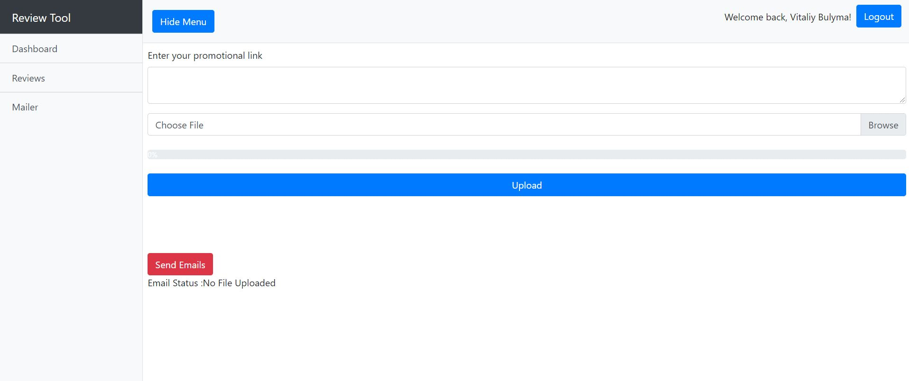

# Review tool and Mailer

## How it works

Mailer Page quick overview:

1. In the text box user writes the content of the email they wish to send
2. Upload a CSV file with the list of emails, the list of emails found will be rendered
3. Click send Emails, the list of sent emails will be rendered


### Google Log in

When user sign-in using Google, only google id and name are stored in the database, which will later be used to authenticate the user. User google id and name is taken from the database and then encrypted and stored in client browser cookies for further authorization on pages. 
> #### Further improvements: 
* Explore other useful information that could be used from Google Account such as profile image or personal email
* Add Facebook or other Log-in options 
* Add Registration/Login functionality for those who do not wish to use Google Log-in


### File Upload

User is able to upload a  CSV file from the computer, the app will send the file to the server to client/public/uploads folder, rename the file to data.csv to simplify further processing Next, it will search CSV file for a field with the name "Email", and create a list of all emails it found in the file, and render that list back in the client browser. Sample CSV file, included in main directory
> #### Further Improvements
* Allow for better verification of the uploaded file, such as file format
* Improve the logic of searching for an email in the CSV file. As it is coded right now the app is looking for the field "Email" only, need to improve the logic to also include "email", "emails", "Emails", "customer_emails", etc
* Include retrieving other information from the CSV file, such as name of the person(to make an email content more individually tailored), postal code, or any other information available in the CSV  file


### Mailer 

Next step, when the user clicks the button "Send Emails":

1. Reads the list of emails from the CSV file (If the file does not exist, the app sends an error message to the client)
2. Retrieves the list of all emails in the database
3. Compares each email from the uploaded file against each email from the database to see if it is already in the database of previously sent emails.
4. If all recipients emails in the CSV file have already been used previously and exist in the database (they received an email from us previously) the app sends back the message to the client  "No New Records are found in the CSV file.". The process terminates, and the uploaded CSV file is deleted from the server for the security purpose.
5. If the app finds new emails in the CSV files, it adds it to the mailer list. And sends email one by one (to avoid the recipient of our emails seeing the entire emails list, this logic was added for privacy reasons)
6. All "new emails" then added to the database.
7. CSV file then deleted from the server 3 seconds after all emails are sent, with the confirmation message. If there is a problem deleting the file from the server, the app sends the message "File was not removed from the system" 

> #### Further Improvements
* Improve the content of the email to include tracking capabilities, such as URL shorteners, or 1px images to attempt being able to know if email was not only delivered, but also opened by the recipient

## Accounts needed

* Mongo Db - Click [here](https://www.mongodb.com/) to go to MongoDB site to register. This is needed to create a database of emails which already received an email from us.  A quick tutorial on how to connect to MongoDB [here](https://www.youtube.com/watch?v=KKyag6t98g8&t=571s)
* Google Developer account - register [here](https://console.developers.google.com/) . This is needed to register the google app which will allow us to use google sign-in using OAuth credentials.
* In this project I used [Namecheap Private Email Services](https://www.namecheap.com/hosting/email/) which has a sending limit of 500 emails per hour and supports delivery status, amongst other benefits. 

## Emailer package

Emailing functionality is powered by [Nodemailer](https://nodemailer.com/usage/). This package allows sending emails, by using a regular Gmail account(however not recommended since Gmail does not work outside of the localhost environment), or by using SMTP server credentials provided by email provider(such as Namecheap private email.). Nodemailer provides functionality to see emails accepted/rejected by the server which is very useful for the app. 

## Quick Start

1. Install dependencies server/client

```bash

npm install in parent directory
cd client
npm install in client directory
```

command above will install all dependencies in folders.


2. Fill in .env file in parent/main, dev.js, prod.js with all new accounts information (database connection, email and password, google api secret and key) :


# Serve front-end on localhost:3000
run command below in the main folder to run the app on localhost

```bash
npm run dev
```


